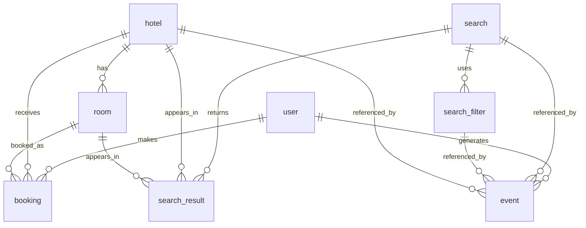

# 필터링 여행 데이터 SQLite 테이블 명세

## 데이터 구성

- `hotel`, `room`: 전체 CSV
- 나머지 6개 테이블: `_filtered.csv`
- 업무 테이블: `8`개 / 전체 `23,704`행
- 빈 문자열은 `NULL`, 날짜·시각은 원문을 보존한 `TEXT`로 저장했습니다.
- 불리언 플래그는 `1`(참), `0`(거짓)으로 저장했습니다.
- 외래키 제약은 강제하지 않고 참조 누락 건수를 아래에 별도로 검증했습니다.

## 테이블 요약

| 테이블 | 행 수 | 기본키 | 범위 및 설명 | 원본 CSV |
|---|---:|---|---|---|
| `hotel` | 1,000 | `hotel_id` | 전체 호텔 마스터 및 실제 호텔 매핑 정보 | `hotel_2026-09-01.csv` |
| `room` | 3,000 | `room_id` | 전체 객실 재고·가격·옵션 정보 | `room_2026-09-01.csv` |
| `user` | 89 | `user_id` | 필터 조건을 통과한 사용자 기본 정보 | `user_2026-09-01_filtered.csv` |
| `search` | 296 | `search_id` | 필터 조건을 통과한 검색 실행 기록 | `search_2026-09-01_filtered.csv` |
| `search_filter` | 296 | `search_filter_id` | 필터 조건을 통과한 검색 상세 필터 | `search_filter_2026-09-01_filtered.csv` |
| `search_result` | 8,555 | `search_result_id` | 필터 조건을 통과한 검색 노출 결과와 순위 | `search_result_2026-09-01_filtered.csv` |
| `booking` | 36 | `booking_id` | 필터 조건을 통과한 예약 기록 | `booking_2026-09-01_filtered.csv` |
| `event` | 10,432 | `event_id` | 필터 조건을 통과한 사용자 행동 이벤트 로그 | `event_2026-09-01_filtered.csv` |

## 주요 관계



| 자식 컬럼 | 부모 컬럼 | 참조 누락 행 수 |
|---|---|---:|
| `room.hotel_id` | `hotel.hotel_id` | 0 |
| `search_filter.search_id` | `search.search_id` | 0 |
| `search_result.search_id` | `search.search_id` | 0 |
| `search_result.hotel_id` | `hotel.hotel_id` | 0 |
| `search_result.room_id` | `room.room_id` | 0 |
| `booking.user_id` | `user.user_id` | 0 |
| `booking.hotel_id` | `hotel.hotel_id` | 0 |
| `booking.room_id` | `room.room_id` | 0 |
| `event.user_id` | `user.user_id` | 0 |
| `event.hotel_id` | `hotel.hotel_id` | 0 |
| `event.search_id` | `search.search_id` | 0 |
| `event.search_filter_id` | `search_filter.search_filter_id` | 0 |

## 테이블별 컬럼

### `hotel`

전체 호텔 마스터 및 실제 호텔 매핑 정보.

| 컬럼 | SQLite 형식 | 키/인덱스 | NULL 수 | 설명 |
|---|---|---|---:|---|
| `hotel_id` | `TEXT` | PK | 0 | 호텔 식별자 |
| `hotel_name` | `TEXT` | - | 0 | 호텔명 |
| `city_name` | `TEXT` | - | 0 | 서비스상 도시명 |
| `grade` | `INTEGER` | - | 0 | 호텔 등급 |
| `hotel_address` | `TEXT` | - | 0 | 서비스상 호텔 주소 |
| `user_rating` | `REAL` | - | 0 | 사용자 평점 |
| `review_count` | `INTEGER` | - | 0 | 리뷰 수 |
| `property_type` | `TEXT` | - | 0 | 숙소 유형 |
| `actual_address` | `TEXT` | - | 509 | 실제 주소 |
| `actual_city` | `TEXT` | - | 509 | 실제 도시 |
| `actual_prefecture` | `TEXT` | - | 678 | 실제 도도부현 |
| `actual_postal_code` | `TEXT` | - | 678 | 실제 우편번호 |
| `actual_latitude` | `REAL` | - | 509 | 실제 위도 |
| `actual_longitude` | `REAL` | - | 509 | 실제 경도 |
| `actual_phone` | `TEXT` | - | 520 | 실제 전화번호 |
| `actual_star_rating` | `REAL` | - | 688 | 실제 성급 |
| `supplier_hotel_code` | `TEXT` | - | 552 | 공급사 호텔 코드 |
| `rtx_code` | `TEXT` | - | 678 | RTX 코드 |
| `agoda_code` | `TEXT` | - | 695 | Agoda 코드 |
| `expedia_code` | `TEXT` | - | 831 | Expedia 코드 |
| `top_selling_rank` | `INTEGER` | - | 881 | 판매 상위 순위 |
| `source_last_mapped_at` | `TEXT` | - | 552 | 원천 데이터와 마지막으로 매핑한 시각 |
| `actual_data_sources` | `TEXT` | - | 509 | 실제 정보 원천 |
| `data_origin` | `TEXT` | - | 0 | 데이터 출처 또는 생성 방식 |

### `room`

전체 객실 재고·가격·옵션 정보.

| 컬럼 | SQLite 형식 | 키/인덱스 | NULL 수 | 설명 |
|---|---|---|---:|---|
| `room_id` | `TEXT` | PK | 0 | 객실 식별자 |
| `hotel_id` | `TEXT` | INDEX | 0 | 호텔 식별자 |
| `guest_count` | `INTEGER` | - | 0 | 인원 수 |
| `room_count` | `INTEGER` | - | 0 | 객실 수 |
| `room_options` | `TEXT` | - | 0 | 객실 옵션 JSON 문자열 |
| `pay_later_flag` | `INTEGER` | - | 0 | 후결제 가능 여부(1/0) |
| `free_cancel_flag` | `INTEGER` | - | 0 | 무료 취소 가능 여부(1/0) |
| `room_price` | `INTEGER` | - | 0 | 객실 가격 |
| `room_type` | `TEXT` | - | 0 | 객실 유형 |
| `data_origin` | `TEXT` | - | 0 | 데이터 출처 또는 생성 방식 |

### `user`

필터 조건을 통과한 사용자 기본 정보.

| 컬럼 | SQLite 형식 | 키/인덱스 | NULL 수 | 설명 |
|---|---|---|---:|---|
| `user_id` | `TEXT` | PK | 0 | 사용자 식별자 |
| `user_name` | `TEXT` | - | 0 | 사용자 표시명 |
| `age_group` | `TEXT` | - | 48 | 연령대 |
| `email` | `TEXT` | - | 48 | 이메일 주소 |
| `signup_at` | `TEXT` | - | 0 | 가입 시각 |
| `data_origin` | `TEXT` | - | 0 | 데이터 출처 또는 생성 방식 |

### `search`

필터 조건을 통과한 검색 실행 기록.

| 컬럼 | SQLite 형식 | 키/인덱스 | NULL 수 | 설명 |
|---|---|---|---:|---|
| `search_id` | `TEXT` | PK | 0 | 검색 식별자 |
| `session_id` | `TEXT` | INDEX | 0 | 세션 식별자 |
| `search_time` | `TEXT` | INDEX | 0 | 검색 시각 |
| `query_text` | `TEXT` | - | 108 | 검색어 |
| `checkin_date` | `TEXT` | - | 0 | 체크인 날짜 |
| `checkout_date` | `TEXT` | - | 0 | 체크아웃 날짜 |
| `total_result_count` | `INTEGER` | - | 0 | 검색 결과 수 |
| `sort_option` | `TEXT` | - | 0 | 정렬 기준 |
| `guest_count` | `INTEGER` | - | 0 | 인원 수 |
| `destination` | `TEXT` | - | 45 | 목적지 |
| `data_origin` | `TEXT` | - | 0 | 데이터 출처 또는 생성 방식 |

### `search_filter`

필터 조건을 통과한 검색 상세 필터.

| 컬럼 | SQLite 형식 | 키/인덱스 | NULL 수 | 설명 |
|---|---|---|---:|---|
| `search_filter_id` | `TEXT` | PK | 0 | 검색 필터 식별자 |
| `search_id` | `TEXT` | INDEX | 0 | 검색 식별자 |
| `property_type` | `TEXT` | - | 296 | 숙소 유형 |
| `property_grade` | `INTEGER` | - | 296 | 선택 숙소 등급 |
| `user_rating_min` | `REAL` | - | 144 | 최소 평점 |
| `price` | `INTEGER` | - | 150 | 선택 가격 기준 |
| `amenity_count` | `INTEGER` | - | 0 | 선택 편의시설 수 |
| `region` | `TEXT` | - | 45 | 선택 지역 |
| `data_origin` | `TEXT` | - | 0 | 데이터 출처 또는 생성 방식 |

### `search_result`

필터 조건을 통과한 검색 노출 결과와 순위.

| 컬럼 | SQLite 형식 | 키/인덱스 | NULL 수 | 설명 |
|---|---|---|---:|---|
| `search_result_id` | `TEXT` | PK | 0 | 검색 결과 행 식별자 |
| `search_id` | `TEXT` | INDEX | 0 | 검색 식별자 |
| `hotel_id` | `TEXT` | INDEX | 0 | 호텔 식별자 |
| `room_id` | `TEXT` | INDEX | 0 | 객실 식별자 |
| `result_score` | `REAL` | - | 0 | 검색 결과 점수 |
| `result_rank` | `INTEGER` | - | 0 | 노출 순위 |
| `price_rank` | `INTEGER` | - | 0 | 가격 순위 |
| `data_origin` | `TEXT` | - | 0 | 데이터 출처 또는 생성 방식 |

### `booking`

필터 조건을 통과한 예약 기록.

| 컬럼 | SQLite 형식 | 키/인덱스 | NULL 수 | 설명 |
|---|---|---|---:|---|
| `booking_id` | `TEXT` | PK | 0 | 예약 식별자 |
| `user_id` | `TEXT` | INDEX | 0 | 사용자 식별자 |
| `hotel_id` | `TEXT` | INDEX | 0 | 호텔 식별자 |
| `room_id` | `TEXT` | INDEX | 0 | 객실 식별자 |
| `booking_status` | `TEXT` | - | 0 | 예약 상태 |
| `booking_amount` | `INTEGER` | - | 0 | 예약 금액 |
| `booking_at` | `TEXT` | INDEX | 0 | 예약 시각 |
| `checkin_date` | `TEXT` | - | 0 | 체크인 날짜 |
| `checkout_date` | `TEXT` | - | 0 | 체크아웃 날짜 |
| `guest_count` | `INTEGER` | - | 0 | 인원 수 |
| `room_count` | `INTEGER` | - | 0 | 객실 수 |
| `cancellation_deadline` | `TEXT` | - | 0 | 취소 기한 |
| `data_origin` | `TEXT` | - | 0 | 데이터 출처 또는 생성 방식 |

### `event`

필터 조건을 통과한 사용자 행동 이벤트 로그.

| 컬럼 | SQLite 형식 | 키/인덱스 | NULL 수 | 설명 |
|---|---|---|---:|---|
| `event_id` | `TEXT` | PK | 0 | 이벤트 식별자 |
| `session_id` | `TEXT` | INDEX | 0 | 세션 식별자 |
| `event_type` | `TEXT` | INDEX | 0 | 이벤트 유형 |
| `event_at` | `TEXT` | INDEX | 0 | 이벤트 발생 시각 |
| `hotel_id` | `TEXT` | INDEX | 647 | 호텔 식별자 |
| `search_filter_id` | `TEXT` | INDEX | 158 | 검색 필터 식별자 |
| `search_id` | `TEXT` | INDEX | 158 | 검색 식별자 |
| `user_id` | `TEXT` | INDEX | 0 | 사용자 식별자 |
| `rating` | `REAL` | - | 10,280 | 이벤트 평점 |
| `session_end_time` | `TEXT` | - | 1,987 | 세션 종료 시각 |
| `review_completed_at` | `TEXT` | - | 10,432 | 리뷰 완료 시각 |
| `review_text` | `TEXT` | - | 10,432 | 리뷰 본문 |
| `device` | `TEXT` | - | 9,688 | 사용 기기 |
| `data_origin` | `TEXT` | - | 0 | 데이터 출처 또는 생성 방식 |

## 보조 테이블

`_import_metadata`에는 원본 파일명, 행 수, 파일 크기, SHA-256과 적재 시각이 기록됩니다.

## SQL 예시

```sql
-- 필터링된 검색 결과와 전체 호텔·객실 정보 연결
SELECT sr.search_id, sr.result_rank, h.hotel_name, r.room_type, r.room_price
FROM search_result AS sr
JOIN hotel AS h ON h.hotel_id = sr.hotel_id
JOIN room AS r ON r.room_id = sr.room_id
ORDER BY sr.search_id, sr.result_rank;

-- 필터링된 예약 조회
SELECT b.booking_id, u.user_name, h.hotel_name, b.booking_amount
FROM booking AS b
LEFT JOIN user AS u ON u.user_id = b.user_id
LEFT JOIN hotel AS h ON h.hotel_id = b.hotel_id;
```
