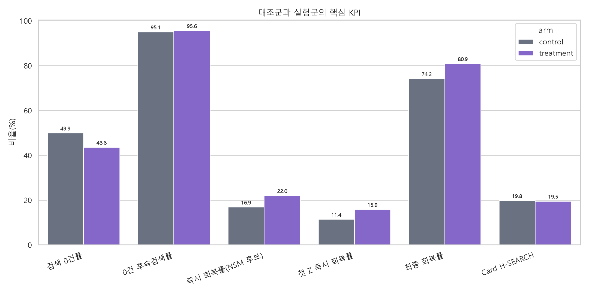
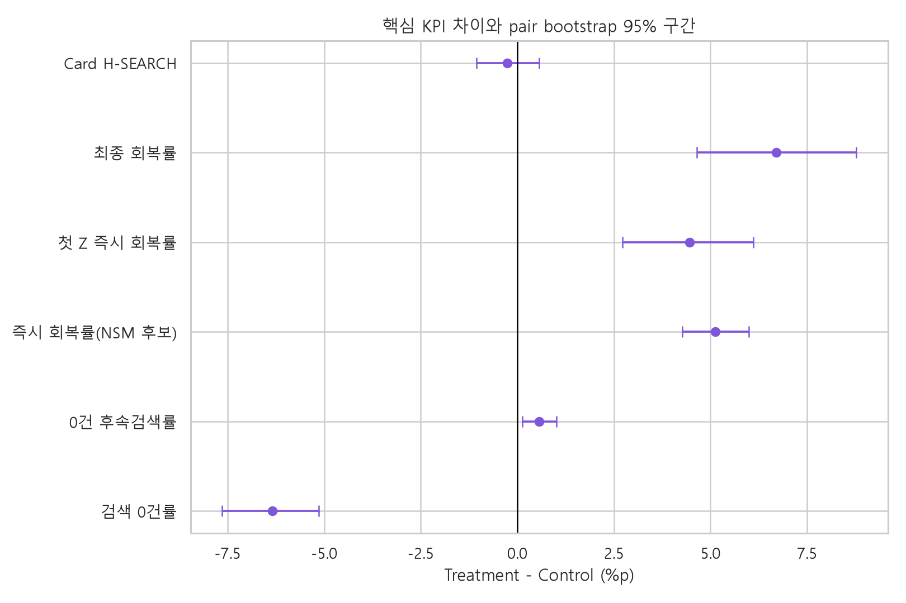
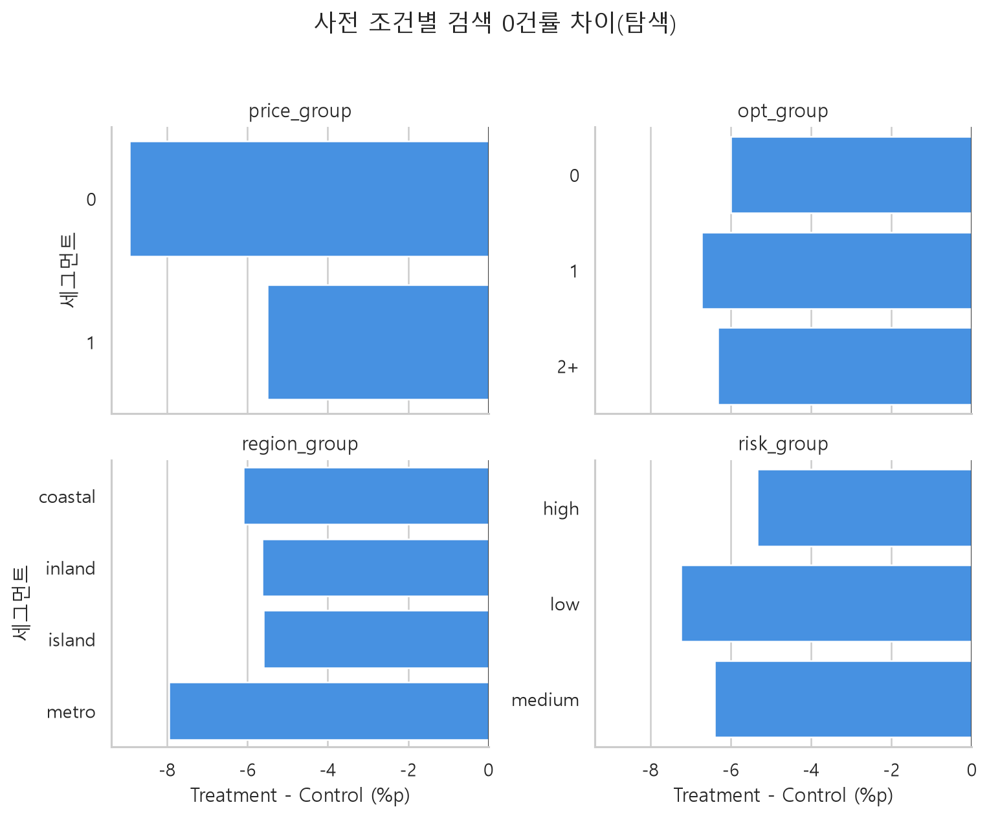
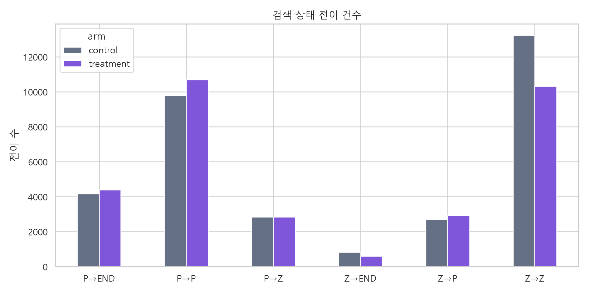

# 호텔검색 10,000명 합성 A/B NSM·KPI·가설 분석보고서

- 작성일: 2026-09-07
- 분석 DB: `호텔검색_1만명증강_탐색용AB10000_260907_1544_01_ERD보존_정수키_16K.sqlite`
- 분석 성격: 고정 생성 규칙을 사용한 합성 A/B 시뮬레이션
- 실행 환경: Python, pandas, NumPy, SciPy, statsmodels, Matplotlib, Seaborn, SQLite
- 재현 노트북: `호텔검색_1만명NSMKPI가설분석_20260907_v01_현행본.ipynb`

## 1. 결론

실험군은 검색결과가 0건일 때 `region_change` 행동과 `Z→P` 회복확률 `+6%p`를 함께 적용한 합성 집단이다. 합성 모형 안에서는 검색 0건률이 6.34%p 낮아지고, NSM 후보인 즉시 회복률이 5.12%p 높아졌다.

상세진입은 개선되지 않았다. 결과가 있는 전체 검색의 1위 호텔 상세진입률은 0.27%p 낮았고, 즉시 회복 직후 검색의 상세진입률도 0.62%p 낮았다.

이 결과는 지역 변경의 실제 효과를 검증한 결과가 아니다. 생성 규칙에 회복확률 증가를 직접 넣었기 때문에 “가정한 회복 변화가 KPI에 반영됐다”는 뜻이다.

## 2. 데이터 품질과 분석 모집단

| 항목 | 결과 |
|---|---:|
| 사용자 | 10,000명 |
| 세션 | 10,000개 |
| 검색 | 65,355건 |
| 검색결과 | 2,023,419건 |
| 이벤트 | 2,152,148건 |
| 대조군·실험군 | 각 5,000명 |
| pair | 5,000개 |
| PK 중복 | 0건 |
| FK 위반 | 0건 |
| pair 불균형 | 0건 |
| SQLite 무결성 | `ok` |

분석 모집단에서 행을 삭제하거나 결측값을 대체하지 않았다. `Search`를 `session_id`로 `SessionSynthetic`과 연결하고, 다시 `user_id`로 `UserSynthetic`과 연결했다. 연결 후 검색 행 수는 원본과 같은 65,355건이다.

`ActionEvent.search_id`가 NULL인 세션 종료 이벤트는 상세진입 계산에서 자동 제외된다. 예약 테이블은 0행이므로 예약률과 매출은 분석하지 않았다.

## 3. NSM과 KPI 계약

### NSM 후보

**즉시 회복률**을 현재 NSM 후보로 사용했다.

```text
즉시 회복률
= 검색결과 0건 다음 검색에서 결과가 1건 이상 나온 전이
  ÷ 검색결과 0건 후 다음 검색이 존재하는 전이
```

이 지표는 사용자가 0건 화면을 본 뒤 바로 결과를 찾았는지 보여준다. 실제 실험 전에는 검색 0건률과 즉시 회복률 중 하나를 최종 주 지표로 사전 확정해야 한다.

### KPI 정의

| KPI | 분자 | 분모 | grain |
|---|---|---|---|
| 검색 0건률 | 결과 수가 0인 고유 검색 | 전체 고유 검색 | 검색 |
| 0건 후속검색률 | 다음 검색이 있는 0건 검색 | 전체 0건 검색 | 검색 전이 |
| 즉시 회복률 | 다음 결과가 1건 이상인 0건 전이 | 다음 검색이 있는 0건 전이 | 검색 전이 |
| 첫 Z 즉시 회복률 | 세션 첫 0건 다음 결과가 1건 이상 | 후속 검색이 있는 세션 첫 0건 | 세션 첫 실패 |
| 최종 회복률 | 마지막 검색 결과가 1건 이상인 0건 경험 세션 | 0건 경험 세션 | 세션 |
| Card H-SEARCH | 1위 호텔 상세진입이 한 번 이상 있는 양수 검색 | 결과가 있는 고유 검색 | 검색 |

## 4. 전체 KPI 결과

| KPI | 대조군 분자/분모 | 대조군 | 실험군 분자/분모 | 실험군 | 차이 | 조건부 95% 구간 |
|---|---:|---:|---:|---:|---:|---:|
| 검색 0건률 | 16,761/33,572 | 49.93% | 13,853/31,783 | 43.59% | **-6.34%p** | -7.64~-5.13%p |
| 0건 후속검색률 | 15,935/16,761 | 95.07% | 13,249/13,853 | 95.64% | **+0.57%p** | +0.13~+1.01%p |
| 즉시 회복률 | 2,693/15,935 | 16.90% | 2,918/13,249 | 22.02% | **+5.12%p** | +4.27~+5.99%p |
| 첫 Z 즉시 회복률 | 351/3,073 | 11.42% | 487/3,067 | 15.88% | **+4.46%p** | +2.72~+6.11%p |
| 최종 회복률 | 2,376/3,202 | 74.20% | 2,560/3,164 | 80.91% | **+6.71%p** | +4.65~+8.77%p |
| Card H-SEARCH | 3,330/16,811 | 19.81% | 3,504/17,930 | 19.54% | **-0.27%p** | -1.06~+0.57%p |



**수치 해석**

- 즉시 회복률은 실험군 22.02%로 대조군 16.90%보다 5.12%p 높다.
- 검색 0건률은 실험군 43.59%로 대조군 49.93%보다 6.34%p 낮다.
- 반면 Card H-SEARCH 차이는 -0.27%p이고 구간이 0을 포함한다. 회복 증가가 상세진입 증가로 연결됐다고 판단할 수 없다.
- 회복률 증가는 생성 규칙의 `Z→P +0.06`에 조건부이므로 실제 기능의 인과효과로 해석하지 않는다.



조건부 구간은 `pair_id` 5,000개를 단위로 대조군과 실험군을 함께 복원추출한 2,000회 bootstrap 결과다. 이 구간은 현재 합성 모형의 반복 변동만 나타낸다. 원본 소표본의 편향, 모형 오류와 실제 사용자 반응의 불확실성은 포함하지 않는다.

## 5. 가설 판정

| 가설 | 분석 결과 | 판정 | 근거와 한계 |
|---|---|---|---|
| H0: 대조군과 실험군의 성과 차이가 없다 | 검색 0건률 -6.34%p, 즉시 회복 +5.12%p | 합성 모형 안에서 주요 회복 지표는 차이 있음 | 생성 단계에서 효과를 직접 설정함 |
| H1: 의도 맞춤 제안은 전체 회복률을 높인다 | 즉시 회복 +5.12%p, 최종 회복 +6.71%p | **합성 모형 안에서 지지** | 실제 구현은 의도별 맞춤이 아닌 지역 변경 중심 패키지 |
| H2: 개선 효과는 6개 의도군별로 다르다 | `intent_segment` 없음 | **검정 불가** | 가격·옵션·지역·위험층은 의도군이 아님 |
| H3: 결과 회복은 상세진입 증가로 이어진다 | 전체 Card H -0.27%p, 회복 직후 상세진입 -0.62%p | **지지되지 않음** | 회복자는 사후 선택 집단이고 Card H 확률은 arm 공통 생성 |
| H4: 반복 방지 안내는 동일 조건 반복을 낮춘다 | 전용 처치·의도군 없음 | **검정 불가** | `condition_keeper`와 노출 로그 부재 |
| H5: 지역 확대는 위치 유연형 회복에 특히 효과적이다 | 실험군의 0건 이후 지역 변경 강제 | **검정 불가** | `location_flexible` 부재, 지역 변경과 +6%p가 결합됨 |
| H6: 검색어 제안은 표현 수정형 상세진입을 높인다 | 전용 제안·의도군 없음 | **검정 불가** | `query_reframer`와 제안 노출·선택 로그 부재 |

### H3 추가 탐색

즉시 회복된 다음 검색 중 1위 호텔 상세진입 여부를 별도로 계산했다.

| 집단 | 상세진입/즉시 회복 검색 | 비율 |
|---|---:|---:|
| 대조군 | 503/2,693 | 18.68% |
| 실험군 | 527/2,918 | 18.06% |
| 차이 | - | **-0.62%p** |

회복된 검색 수는 늘었지만, 회복 한 건이 상세진입으로 이어지는 비율은 높아지지 않았다. 따라서 회복 기능과 호텔 정렬·상품 매력 개선을 별도 과제로 보는 것이 타당하다.

## 6. 사전 조건별 탐색 결과

`sample_stratum`의 가격 설정, 옵션 수, 지역군, 위험층을 사용했다. 모든 조건에서 실험군 검색 0건률이 낮았지만, 이는 6개 의도군별 효과 검정이 아니다.

| 사전 조건 | 검색 0건률 차이, 실험군-대조군 |
|---|---:|
| 가격 미설정 | -8.93%p |
| 가격 설정 | -5.50%p |
| 옵션 0개 | -6.00%p |
| 옵션 1개 | -6.71%p |
| 옵션 2개 이상 | -6.33%p |
| coastal | -6.09%p |
| inland | -5.63%p |
| island | -5.60%p |
| metro | -7.95%p |
| 위험 high | -5.34%p |
| 위험 low | -7.24%p |
| 위험 medium | -6.40%p |



**수치 해석**

- 가장 큰 감소는 가격 미설정 -8.93%p이고, 가장 작은 감소는 위험 high -5.34%p다.
- 모든 사전 조건에서 방향은 같지만, 공통 `Z→P +0.06`이 서로 다른 검색 경로에 적용된 결과일 수 있다.
- 실제 세그먼트 우선순위를 정하려면 `intent_segment`를 구현하고 다중비교 기준을 사전등록해야 한다.

## 7. 검색 상태 전이

| 전이 | 대조군 | 실험군 | 차이 |
|---|---:|---:|---:|
| Z→Z | 13,242 | 10,331 | -2,911 |
| Z→P | 2,693 | 2,918 | +225 |
| Z→END | 826 | 604 | -222 |
| P→Z | 2,840 | 2,843 | +3 |
| P→P | 9,797 | 10,691 | +894 |
| P→END | 4,174 | 4,396 | +222 |



실험군에서는 반복 실패인 Z→Z와 실패 후 종료인 Z→END가 감소하고, 즉시 회복인 Z→P가 증가했다. 이 흐름은 실험군 생성 규칙과 일치한다.

## 8. 계산 추적

### 즉시 회복률 예시

```text
원시 필드
Search.session_id, search_sequence, total_result_count

변환
session_id 안에서 search_sequence 순으로 정렬
다음 행의 total_result_count를 next_count로 생성

대조군
분자 = 현재 결과 0건, 다음 결과 1건 이상 = 2,693
분모 = 현재 결과 0건, 다음 검색 존재 = 15,935
2,693 ÷ 15,935 × 100 = 16.90%

실험군
분자 = 2,918
분모 = 13,249
2,918 ÷ 13,249 × 100 = 22.02%

차이
22.02% - 16.90% = +5.12%p
```

### Card H-SEARCH 예시

```text
분모
Search.total_result_count > 0인 고유 search_id

분자
SearchResult.result_rank = 1의 hotel_id와
ActionEvent.event_type = 'hotel_detail_view'의 search_id·hotel_id가 연결된 고유 검색

반복 이벤트 행
한 검색에 여러 상세 이벤트가 있어도 분자는 1회로 계산
```

## 9. 최종 판단과 다음 검증

현재 데이터로 판단할 수 있는 내용은 다음과 같다.

> 합성 모형에서 0건 이후 지역 변경 중심 패키지와 회복확률 증가를 적용하면 검색 실패가 줄고 즉시·최종 회복이 증가한다. 상세진입은 증가하지 않는다.

현재 데이터로 판단할 수 없는 내용은 다음과 같다.

- 실제 사용자가 지역 변경 제안을 선택하는지
- 지역 변경 자체가 회복 증가의 원인인지
- 6개 의도군 중 어떤 집단에서 어떤 기능이 효과적인지
- 예약과 매출이 증가하는지

실제 A/B 테스트에서는 사용자 단위로 무작위 배정하고 다음 로그를 연결해야 한다.

1. 제안 노출
2. 제안 유형
3. 사용자 선택 또는 거절
4. 실제 조건 변경
5. 다음 검색 결과
6. 1위 호텔 상세진입
7. 예약 완료

주 지표는 검색 0건률이나 즉시 회복률 중 하나를 사전 확정하고, 최종 회복률과 Card H-SEARCH는 보조 KPI로 두는 것이 적절하다.
